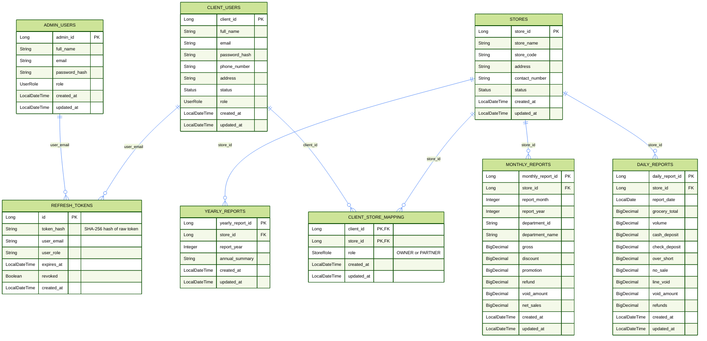

# Software Requirements Specification — Hands Of Retail Backend API

**Version:** 2.2  
**Date:** 2026-06-11  
**Base URL:** `http://localhost:8080`  
**Content-Type:** `application/json` (unless noted otherwise)  
**Auth Scheme:** HttpOnly Cookies (`access_token` + `refresh_token`)

---

## Table of Contents

1. [Introduction](#1-introduction)
2. [System Architecture](#2-system-architecture)
3. [Authentication & Authorization](#3-authentication--authorization)
4. [Common Response Envelope](#4-common-response-envelope)
5. [Error Handling Reference](#5-error-handling-reference)
6. [Database Schema](#6-database-schema)
7. [Endpoint Specifications](#7-endpoint-specifications)
   - [7.1 Auth APIs](#71-auth-apis)
   - [7.2 Admin — Client Management](#72-admin--client-management)
   - [7.3 Admin — Store Management](#73-admin--store-management)
   - [7.4 Admin — Store Member Management](#74-admin--store-member-management)
   - [7.5 Admin — Daily Reports](#75-admin--daily-reports)
   - [7.6 Admin — Monthly Reports](#76-admin--monthly-reports)
   - [7.7 Admin — Yearly Reports](#77-admin--yearly-reports)
   - [7.8 Client — Store Access](#78-client--store-access)
   - [7.9 Client — Daily Reports](#79-client--daily-reports)
   - [7.10 Client — Monthly Reports](#710-client--monthly-reports)
   - [7.11 Client — Yearly Reports](#711-client--yearly-reports)
8. [Non-Functional Requirements](#8-non-functional-requirements)
9. [Business Rules](#9-business-rules)
10. [Appendix A — Endpoint Quick Reference](#appendix-a--endpoint-quick-reference)

---

## 1. Introduction

### 1.1 Project Overview

**Hands Of Retail** is a Spring Boot 3.4.x REST API that manages retail **clients**, **stores**, and **sales reports** (daily, monthly, yearly). It provides cookie-based JWT-authenticated APIs for two roles:

- **ADMIN** — full CRUD over all resources
- **CLIENT** — read-only access to stores and reports they are associated with (as OWNER or PARTNER)

### 1.2 Technology Stack

| Layer             | Technology                                                     |
| ----------------- | -------------------------------------------------------------- |
| Runtime           | Java 21                                                        |
| Framework         | Spring Boot 3.4.x                                              |
| Security          | Spring Security + JWT (HttpOnly Cookies)                       |
| Persistence       | Spring Data JPA + Hibernate                                    |
| Default Database  | H2 (file-based, `./database/h2/retail-db`)                     |
| Alt Database      | PostgreSQL (via config)                                        |
| Schema Migrations | Flyway                                                         |
| API Docs          | Swagger / OpenAPI (auto-generated at `/swagger-ui/index.html`) |

### 1.3 Scope

The backend covers:

- Authentication (login / token issuance via HttpOnly cookies / token rotation / logout)
- Client management (CRUD)
- Store management (CRUD + status toggle + M:M member management)
- Daily reporting (CRUD + filtering)
- Monthly reporting (CRUD + bulk Excel upload + filtering)
- Yearly reporting (CRUD + filtering)

---

## 2. System Architecture

```
Browser / Postman
      │  Requests carry HttpOnly cookies automatically (no manual headers)
      │    access_token  (JWT, Path=/, 15 min)
      │    refresh_token (opaque, Path=/api/v1/auth, 7 days)
      ▼
Spring Security Filter Chain
      │  JwtAuthenticationFilter → reads access_token cookie,
      │                             validates JWT, sets SecurityContext
      ▼
REST Controllers  (/api/v1/...)
      │
Service Layer (business logic + ownership checks via CLIENT_STORE_MAPPING)
      │
Repository Layer (Spring Data JPA + Specifications)
      │
H2 / PostgreSQL Database
      │  refresh_tokens table (SHA-256 hashed, revocable)
      │  client_store_mapping table (M:M store ownership)
```

### Route Security Matrix

| Path Pattern        | Permitted Roles      |
| ------------------- | -------------------- |
| `/api/v1/auth/**`   | Anonymous (public)   |
| `/api/v1/admin/**`  | `ADMIN` only         |
| `/api/v1/client/**` | `CLIENT` only        |
| `/swagger-ui/**`    | Anonymous (public)   |
| `/v3/api-docs/**`   | Anonymous (public)   |
| `/h2-console/**`    | Anonymous (dev only) |
| Any other path      | Authenticated        |

---

## 3. Authentication & Authorization

### Token Strategy

The API uses a **dual-token HttpOnly cookie** scheme. No `Authorization` header is required — the browser/client attaches cookies automatically.

| Cookie          | Type                 | Lifetime       | Path           | Flags                       |
| --------------- | -------------------- | -------------- | -------------- | --------------------------- |
| `access_token`  | JWT (signed HS256)   | **15 minutes** | `/`            | `HttpOnly; SameSite=Strict` |
| `refresh_token` | Opaque random string | **7 days**     | `/api/v1/auth` | `HttpOnly; SameSite=Strict` |

- The **access token** is a short-lived JWT encoding the user's `email` and `role`. It is validated by `JwtAuthenticationFilter` on every request.
- The **refresh token** is stored as a SHA-256 hash in the `refresh_tokens` database table and is used **only** to issue a new access token via `POST /api/v1/auth/refresh`.
- **Refresh Token Rotation** — every call to `/refresh` revokes the old refresh token and issues a new one.
- On `logout`, both tokens are revoked and both cookies are cleared (`MaxAge=0`).

> **JavaScript cannot read these cookies** because they are `HttpOnly`. This protects against XSS token theft.

### Secure Flag

| Environment        | `Secure` flag                                     |
| ------------------ | ------------------------------------------------- |
| Local dev (HTTP)   | `false`                                           |
| Production (HTTPS) | `true` — set via `JWT_REFRESH_COOKIE_SECURE=true` |

### Client Authorization

CLIENT-role users are authorized to access a store's resources only if a row exists in `CLIENT_STORE_MAPPING` for their `(client_id, store_id)` pair. Both `OWNER` and `PARTNER` roles grant read access to store reports. Ownership role does **not** grant any additional API permissions — the distinction is informational only (visible in `clientRole` field).

---

## 4. Common Response Envelope

Every API response (success **and** error) is wrapped in the following JSON envelope:

```json
{
  "success": true,
  "message": "Human-readable status message",
  "data": { ... },
  "errors": { "fieldName": "error message" },
  "timestamp": "2026-06-06T10:00:00.000Z"
}
```

| Field       | Type               | Always Present       | Description                                 |
| ----------- | ------------------ | -------------------- | ------------------------------------------- |
| `success`   | `boolean`          | ✅                   | `true` on success, `false` on error         |
| `message`   | `string`           | ✅                   | Human-readable outcome description          |
| `data`      | `object` / `array` | ❌ (omitted if null) | Payload on success; omitted on error        |
| `errors`    | `object`           | ❌ (omitted if null) | Field-level validation error map            |
| `timestamp` | `ISO-8601 string`  | ✅                   | Server UTC time when response was generated |

> All `null` fields are omitted from the JSON response via `@JsonInclude(NON_NULL)`.

---

## 5. Error Handling Reference

All error responses follow the common envelope with `"success": false`.

### 5.1 HTTP Status Codes

| HTTP Status | When Triggered                                              | Exception Class                   |
| ----------- | ----------------------------------------------------------- | --------------------------------- |
| `400`       | Validation failure on request body fields                   | `MethodArgumentNotValidException` |
| `400`       | General bad request (business logic rejection)              | `BadRequestException`             |
| `401`       | Missing or invalid JWT token                                | `UnauthorizedException`           |
| `403`       | Valid token but insufficient role or ownership              | `ForbiddenException`              |
| `404`       | Referenced resource does not exist                          | `ResourceNotFoundException`       |
| `409`       | Duplicate resource (e.g., email or store code already used) | `DuplicateResourceException`      |
| `500`       | Unexpected internal server error                            | `Exception` (fallback)            |

### 5.2 Standard Error Response Examples

**400 — Validation Error (field-level)**

```json
{
  "success": false,
  "message": "Validation failed",
  "errors": {
    "email": "must be a well-formed email address",
    "password": "must not be blank"
  },
  "timestamp": "2026-06-06T10:00:00.000Z"
}
```

**400 — Bad Request (business logic)**

```json
{
  "success": false,
  "message": "Cannot remove the store owner",
  "timestamp": "2026-06-06T10:00:00.000Z"
}
```

**401 — Unauthorized**

```json
{
  "success": false,
  "message": "Authentication required",
  "timestamp": "2026-06-06T10:00:00.000Z"
}
```

**403 — Forbidden**

```json
{
  "success": false,
  "message": "Access denied",
  "timestamp": "2026-06-06T10:00:00.000Z"
}
```

**404 — Not Found**

```json
{
  "success": false,
  "message": "Store not found with id: 99",
  "timestamp": "2026-06-06T10:00:00.000Z"
}
```

**409 — Conflict / Duplicate**

```json
{
  "success": false,
  "message": "Email already in use: john@gmail.com",
  "timestamp": "2026-06-06T10:00:00.000Z"
}
```

**500 — Internal Server Error**

```json
{
  "success": false,
  "message": "Unexpected error",
  "timestamp": "2026-06-06T10:00:00.000Z"
}
```

---

## 6. Database Schema



### Enumerations

| Enum        | Values               |
| ----------- | -------------------- |
| `UserRole`  | `ADMIN`, `CLIENT`    |
| `Status`    | `ACTIVE`, `INACTIVE` |
| `StoreRole` | `OWNER`, `PARTNER`   |

### Store Ownership Model

Stores and clients have a **many-to-many** relationship managed through `CLIENT_STORE_MAPPING`:

- Every store has **exactly one OWNER** (enforced by a partial unique index on `store_id WHERE role = 'OWNER'`).
- A store can have **zero or more PARTNER** clients.
- A client can be the OWNER of multiple stores.
- A client can be a PARTNER in multiple stores.
- A client can simultaneously be the OWNER of one store and a PARTNER in another.
- Store responses (`clientId`, `clientName`) represent the **OWNER** in admin contexts.

---

## 7. Endpoint Specifications

---

### 7.1 Auth APIs

---

#### `POST /api/v1/auth/login`

**Purpose:** Authenticate a user (admin or client). Issues both tokens as HttpOnly cookies — no raw token is returned in the response body.  
**Auth Required:** ❌ None  
**HTTP Status (success):** `200 OK`

##### Request Headers

| Header         | Value              |
| -------------- | ------------------ |
| `Content-Type` | `application/json` |

##### Request Body

| Field      | Type     | Required | Validation                   |
| ---------- | -------- | -------- | ---------------------------- |
| `email`    | `string` | ✅       | Must be a valid email format |
| `password` | `string` | ✅       | Must not be blank            |

```json
{
  "email": "admin@gmail.com",
  "password": "password123"
}
```

##### Success Response — `200 OK`

Two HttpOnly cookies are set via `Set-Cookie` response headers.

| Cookie          | Content              | Path           | MaxAge   | Flags                       |
| --------------- | -------------------- | -------------- | -------- | --------------------------- |
| `access_token`  | Signed JWT           | `/`            | 900 s    | `HttpOnly; SameSite=Strict` |
| `refresh_token` | Opaque random string | `/api/v1/auth` | 604800 s | `HttpOnly; SameSite=Strict` |

```json
{
  "success": true,
  "message": "Login successful",
  "data": {
    "role": "ADMIN",
    "email": "admin@gmail.com",
    "fullName": "Admin User"
  },
  "timestamp": "2026-06-06T10:00:00.000Z"
}
```

##### Response `data` Fields

| Field      | Type     | Description                    |
| ---------- | -------- | ------------------------------ |
| `role`     | `string` | `ADMIN` or `CLIENT`            |
| `email`    | `string` | Authenticated user's email     |
| `fullName` | `string` | Authenticated user's full name |

##### Error Responses

| Status | Scenario                        | `message`                            |
| ------ | ------------------------------- | ------------------------------------ |
| `400`  | Blank or invalid email/password | `"Validation failed"` + `errors` map |
| `401`  | Wrong credentials               | `"Invalid email or password"`        |

---

#### `POST /api/v1/auth/refresh`

**Purpose:** Exchange a valid `refresh_token` cookie for a new `access_token` cookie. Implements **refresh token rotation** — the old token is revoked and a new pair is issued.  
**Auth Required:** ❌ None (authenticated via `refresh_token` cookie)  
**HTTP Status (success):** `200 OK`

##### Request

No request body. The `refresh_token` cookie is attached automatically by the browser.

##### Success Response — `200 OK`

A fresh `access_token` (15 min) and rotated `refresh_token` (7 days) are set in response cookies.

```json
{
  "success": true,
  "message": "Token refreshed",
  "data": {
    "role": "ADMIN",
    "email": "admin@gmail.com",
    "fullName": "Admin User"
  },
  "timestamp": "2026-06-06T10:00:00.000Z"
}
```

##### Error Responses

| Status | Scenario                                | `message`                           |
| ------ | --------------------------------------- | ----------------------------------- |
| `401`  | `refresh_token` cookie missing          | `"Refresh token cookie is missing"` |
| `401`  | Token not found in DB / already rotated | `"Invalid refresh token"`           |
| `401`  | Token revoked                           | `"Refresh token has been revoked"`  |
| `401`  | Token expired (> 7 days)                | `"Refresh token has expired"`       |

---

#### `POST /api/v1/auth/logout`

**Purpose:** Revoke the refresh token in the database and clear both HttpOnly cookies.  
**Auth Required:** ❌ None (authenticated via `refresh_token` cookie)  
**HTTP Status (success):** `200 OK`

##### Request

No request body. The `refresh_token` cookie is attached automatically by the browser.

##### Success Response — `200 OK`

Both `access_token` and `refresh_token` cookies are cleared (`MaxAge=0`).

```json
{
  "success": true,
  "message": "Logged out successfully",
  "timestamp": "2026-06-06T10:00:00.000Z"
}
```

##### Error Responses

| Status | Scenario                        | `message`                           |
| ------ | ------------------------------- | ----------------------------------- |
| `401`  | `refresh_token` cookie missing  | `"Refresh token cookie is missing"` |
| `401`  | Token invalid / already revoked | `"Invalid refresh token"`           |

---

### 7.2 Admin — Client Management

> All endpoints under `/api/v1/admin/**` require a valid `access_token` cookie with role `ADMIN`.

---

#### `POST /api/v1/admin/clients`

**Purpose:** Create a new client user account.  
**Auth Required:** ✅ ADMIN  
**HTTP Status (success):** `201 Created`

##### Request Headers

| Header         | Value              |
| -------------- | ------------------ |
| `Content-Type` | `application/json` |

##### Request Body

| Field         | Type     | Required | Validation                            |
| ------------- | -------- | -------- | ------------------------------------- |
| `fullName`    | `string` | ✅       | Must not be blank                     |
| `email`       | `string` | ✅       | Must be a valid email; must be unique |
| `password`    | `string` | ✅       | Must not be blank                     |
| `phoneNumber` | `string` | ❌       | Optional                              |
| `address`     | `string` | ❌       | Optional                              |

```json
{
  "fullName": "John Doe",
  "email": "john@gmail.com",
  "password": "password123",
  "phoneNumber": "9876543210",
  "address": "New York"
}
```

##### Success Response — `201 Created`

```json
{
  "success": true,
  "message": "Client created",
  "data": {
    "clientId": 1,
    "fullName": "John Doe",
    "email": "john@gmail.com",
    "phoneNumber": "9876543210",
    "address": "New York",
    "status": "ACTIVE",
    "role": "CLIENT"
  },
  "timestamp": "2026-06-06T10:00:00.000Z"
}
```

##### Response `data` Fields

| Field         | Type     | Description                      |
| ------------- | -------- | -------------------------------- |
| `clientId`    | `Long`   | Auto-generated primary key       |
| `fullName`    | `string` | Client's full name               |
| `email`       | `string` | Client's email address           |
| `phoneNumber` | `string` | Client's phone number (nullable) |
| `address`     | `string` | Client's address (nullable)      |
| `status`      | `string` | `ACTIVE` (default on creation)   |
| `role`        | `string` | Always `CLIENT`                  |

##### Error Responses

| Status | Scenario                                          | `message`                                |
| ------ | ------------------------------------------------- | ---------------------------------------- |
| `400`  | Blank `fullName`, invalid email, blank `password` | `"Validation failed"` + `errors` map     |
| `401`  | Missing or invalid JWT                            | `"Authentication required"`              |
| `403`  | Authenticated but not ADMIN                       | `"Access denied"`                        |
| `409`  | Email already in use                              | `"Email already in use: john@gmail.com"` |

---

#### `GET /api/v1/admin/clients`

**Purpose:** Retrieve all registered client accounts.  
**Auth Required:** ✅ ADMIN  
**HTTP Status (success):** `200 OK`

##### Query Parameters

None.

##### Success Response — `200 OK`

```json
{
  "success": true,
  "message": "Clients fetched",
  "data": [
    {
      "clientId": 1,
      "fullName": "John Doe",
      "email": "john@gmail.com",
      "phoneNumber": "9876543210",
      "address": "New York",
      "status": "ACTIVE",
      "role": "CLIENT"
    },
    {
      "clientId": 2,
      "fullName": "Jane Smith",
      "email": "jane@gmail.com",
      "phoneNumber": "9123456789",
      "address": "Los Angeles",
      "status": "INACTIVE",
      "role": "CLIENT"
    }
  ],
  "timestamp": "2026-06-06T10:00:00.000Z"
}
```

##### Error Responses

| Status | Scenario              | `message`                   |
| ------ | --------------------- | --------------------------- |
| `401`  | Missing / invalid JWT | `"Authentication required"` |
| `403`  | Not an ADMIN          | `"Access denied"`           |

---

#### `PUT /api/v1/admin/clients/{id}`

**Purpose:** Update an existing client's details. All fields are optional (partial update).  
**Auth Required:** ✅ ADMIN  
**HTTP Status (success):** `200 OK`

##### Path Parameters

| Name | Type   | Required | Description             |
| ---- | ------ | -------- | ----------------------- |
| `id` | `Long` | ✅       | Client's primary key ID |

##### Request Headers

| Header         | Value              |
| -------------- | ------------------ |
| `Content-Type` | `application/json` |

##### Request Body

| Field         | Type     | Required | Validation                                     |
| ------------- | -------- | -------- | ---------------------------------------------- |
| `fullName`    | `string` | ❌       | Optional                                       |
| `email`       | `string` | ❌       | Must be valid email format if provided; unique |
| `password`    | `string` | ❌       | If provided, hashed and stored                 |
| `phoneNumber` | `string` | ❌       | Optional                                       |
| `address`     | `string` | ❌       | Optional                                       |

```json
{
  "fullName": "John Updated",
  "email": "johnupdated@gmail.com",
  "password": "newpassword456",
  "phoneNumber": "9999999999",
  "address": "Chicago"
}
```

##### Success Response — `200 OK`

```json
{
  "success": true,
  "message": "Client updated",
  "data": {
    "clientId": 1,
    "fullName": "John Updated",
    "email": "johnupdated@gmail.com",
    "phoneNumber": "9999999999",
    "address": "Chicago",
    "status": "ACTIVE",
    "role": "CLIENT"
  },
  "timestamp": "2026-06-06T10:00:00.000Z"
}
```

##### Error Responses

| Status | Scenario                     | `message`                                 |
| ------ | ---------------------------- | ----------------------------------------- |
| `400`  | Invalid email format in body | `"Validation failed"` + `errors` map      |
| `401`  | Missing / invalid JWT        | `"Authentication required"`               |
| `403`  | Not an ADMIN                 | `"Access denied"`                         |
| `404`  | Client ID does not exist     | `"Client not found with id: 99"`          |
| `409`  | New email already in use     | `"Email already in use: other@gmail.com"` |

---

#### `PATCH /api/v1/admin/clients/{id}/status`

**Purpose:** Activate or deactivate a client account without changing other fields.  
**Auth Required:** ✅ ADMIN  
**HTTP Status (success):** `200 OK`

##### Path Parameters

| Name | Type   | Required | Description             |
| ---- | ------ | -------- | ----------------------- |
| `id` | `Long` | ✅       | Client's primary key ID |

##### Request Headers

| Header         | Value              |
| -------------- | ------------------ |
| `Content-Type` | `application/json` |

##### Request Body

| Field    | Type     | Required | Validation                               |
| -------- | -------- | -------- | ---------------------------------------- |
| `status` | `string` | ✅       | Must not be null; `ACTIVE` or `INACTIVE` |

```json
{
  "status": "INACTIVE"
}
```

##### Success Response — `200 OK`

```json
{
  "success": true,
  "message": "Client status updated",
  "data": {
    "clientId": 1,
    "fullName": "John Doe",
    "email": "john@gmail.com",
    "phoneNumber": "9876543210",
    "address": "New York",
    "status": "INACTIVE",
    "role": "CLIENT"
  },
  "timestamp": "2026-06-11T10:00:00.000Z"
}
```

##### Error Responses

| Status | Scenario                    | `message`                            |
| ------ | --------------------------- | ------------------------------------ |
| `400`  | Missing or invalid `status` | `"Validation failed"` + `errors` map |
| `401`  | Missing / invalid JWT       | `"Authentication required"`          |
| `403`  | Not an ADMIN                | `"Access denied"`                    |
| `404`  | Client ID does not exist    | `"Client not found"`                 |

---

### 7.3 Admin — Store Management

---

#### `POST /api/v1/admin/stores`

**Purpose:** Create a new store and assign a client as its OWNER.  
**Auth Required:** ✅ ADMIN  
**HTTP Status (success):** `201 Created`

##### Request Headers

| Header         | Value              |
| -------------- | ------------------ |
| `Content-Type` | `application/json` |

##### Request Body

| Field           | Type     | Required | Validation                                         |
| --------------- | -------- | -------- | -------------------------------------------------- |
| `clientId`      | `Long`   | ✅       | Must not be null; client must exist; becomes OWNER |
| `storeName`     | `string` | ✅       | Must not be blank                                  |
| `storeCode`     | `string` | ✅       | Must not be blank; must be unique                  |
| `address`       | `string` | ❌       | Optional                                           |
| `contactNumber` | `string` | ❌       | Optional                                           |

```json
{
  "clientId": 1,
  "storeName": "Walmart Downtown",
  "storeCode": "WM001",
  "address": "California",
  "contactNumber": "9876543210"
}
```

##### Success Response — `201 Created`

```json
{
  "success": true,
  "message": "Store created",
  "data": {
    "storeId": 1,
    "clientId": 1,
    "clientName": "John Doe",
    "storeName": "Walmart Downtown",
    "storeCode": "WM001",
    "address": "California",
    "contactNumber": "9876543210",
    "status": "ACTIVE"
  },
  "timestamp": "2026-06-06T10:00:00.000Z"
}
```

##### Response `data` Fields

| Field           | Type     | Description                    |
| --------------- | -------- | ------------------------------ |
| `storeId`       | `Long`   | Auto-generated store ID        |
| `clientId`      | `Long`   | ID of the OWNER client         |
| `clientName`    | `string` | Full name of the OWNER client  |
| `storeName`     | `string` | Store name                     |
| `storeCode`     | `string` | Unique store code              |
| `address`       | `string` | Store address (nullable)       |
| `contactNumber` | `string` | Contact number (nullable)      |
| `status`        | `string` | `ACTIVE` (default on creation) |

> `clientRole` is **not** included in admin store responses.

##### Error Responses

| Status | Scenario                                          | `message`                            |
| ------ | ------------------------------------------------- | ------------------------------------ |
| `400`  | Blank `storeName` or `storeCode`, null `clientId` | `"Validation failed"` + `errors` map |
| `401`  | Missing / invalid JWT                             | `"Authentication required"`          |
| `403`  | Not an ADMIN                                      | `"Access denied"`                    |
| `404`  | `clientId` not found                              | `"Client not found with id: 99"`     |
| `409`  | `storeCode` already exists                        | `"Store code already in use: WM001"` |

---

#### `GET /api/v1/admin/stores`

**Purpose:** Retrieve all stores, optionally filtered by client ID and/or status.  
**Auth Required:** ✅ ADMIN  
**HTTP Status (success):** `200 OK`

##### Query Parameters

| Param      | Type     | Required | Description                                         |
| ---------- | -------- | -------- | --------------------------------------------------- |
| `clientId` | `Long`   | ❌       | Filter stores where this client is OWNER or PARTNER |
| `status`   | `string` | ❌       | Filter by status: `ACTIVE` or `INACTIVE`            |

**Example:**

```
GET /api/v1/admin/stores?clientId=1&status=ACTIVE
```

##### Success Response — `200 OK`

```json
{
  "success": true,
  "message": "Stores fetched",
  "data": [
    {
      "storeId": 1,
      "clientId": 1,
      "clientName": "John Doe",
      "storeName": "Walmart Downtown",
      "storeCode": "WM001",
      "address": "California",
      "contactNumber": "9876543210",
      "status": "ACTIVE"
    }
  ],
  "timestamp": "2026-06-06T10:00:00.000Z"
}
```

##### Error Responses

| Status | Scenario              | `message`                   |
| ------ | --------------------- | --------------------------- |
| `401`  | Missing / invalid JWT | `"Authentication required"` |
| `403`  | Not an ADMIN          | `"Access denied"`           |

---

#### `GET /api/v1/admin/stores/{storeId}`

**Purpose:** Retrieve details of a single store by its ID.  
**Auth Required:** ✅ ADMIN  
**HTTP Status (success):** `200 OK`

##### Path Parameters

| Name      | Type   | Required | Description         |
| --------- | ------ | -------- | ------------------- |
| `storeId` | `Long` | ✅       | Store's primary key |

##### Success Response — `200 OK`

```json
{
  "success": true,
  "message": "Store fetched",
  "data": {
    "storeId": 1,
    "clientId": 1,
    "clientName": "John Doe",
    "storeName": "Walmart Downtown",
    "storeCode": "WM001",
    "address": "California",
    "contactNumber": "9876543210",
    "status": "ACTIVE"
  },
  "timestamp": "2026-06-06T10:00:00.000Z"
}
```

##### Error Responses

| Status | Scenario              | `message`                       |
| ------ | --------------------- | ------------------------------- |
| `401`  | Missing / invalid JWT | `"Authentication required"`     |
| `403`  | Not an ADMIN          | `"Access denied"`               |
| `404`  | Store ID not found    | `"Store not found with id: 99"` |

---

#### `PUT /api/v1/admin/stores/{storeId}`

**Purpose:** Update an existing store's details. All fields are optional (partial update). If `clientId` is provided, the OWNER mapping is reassigned to that client.  
**Auth Required:** ✅ ADMIN  
**HTTP Status (success):** `200 OK`

##### Path Parameters

| Name      | Type   | Required | Description         |
| --------- | ------ | -------- | ------------------- |
| `storeId` | `Long` | ✅       | Store's primary key |

##### Request Headers

| Header         | Value              |
| -------------- | ------------------ |
| `Content-Type` | `application/json` |

##### Request Body

| Field           | Type     | Required | Validation                                  |
| --------------- | -------- | -------- | ------------------------------------------- |
| `clientId`      | `Long`   | ❌       | If provided, reassigns OWNER to this client |
| `storeName`     | `string` | ❌       | Optional                                    |
| `storeCode`     | `string` | ❌       | Must be unique if provided                  |
| `address`       | `string` | ❌       | Optional                                    |
| `contactNumber` | `string` | ❌       | Optional                                    |

```json
{
  "clientId": 2,
  "storeName": "Walmart Uptown",
  "storeCode": "WM002",
  "address": "Nevada",
  "contactNumber": "9111111111"
}
```

##### Success Response — `200 OK`

```json
{
  "success": true,
  "message": "Store updated",
  "data": {
    "storeId": 1,
    "clientId": 2,
    "clientName": "Jane Smith",
    "storeName": "Walmart Uptown",
    "storeCode": "WM002",
    "address": "Nevada",
    "contactNumber": "9111111111",
    "status": "ACTIVE"
  },
  "timestamp": "2026-06-06T10:00:00.000Z"
}
```

##### Error Responses

| Status | Scenario                       | `message`                            |
| ------ | ------------------------------ | ------------------------------------ |
| `401`  | Missing / invalid JWT          | `"Authentication required"`          |
| `403`  | Not an ADMIN                   | `"Access denied"`                    |
| `404`  | Store ID not found             | `"Store not found with id: 99"`      |
| `404`  | Provided `clientId` not found  | `"Client not found with id: 99"`     |
| `409`  | New `storeCode` already in use | `"Store code already in use: WM002"` |

---

#### `PATCH /api/v1/admin/stores/{storeId}/status`

**Purpose:** Activate or deactivate a store without changing other fields.  
**Auth Required:** ✅ ADMIN  
**HTTP Status (success):** `200 OK`

##### Path Parameters

| Name      | Type   | Required | Description         |
| --------- | ------ | -------- | ------------------- |
| `storeId` | `Long` | ✅       | Store's primary key |

##### Query Parameters

| Param    | Type     | Required | Values                 |
| -------- | -------- | -------- | ---------------------- |
| `status` | `string` | ✅       | `ACTIVE` or `INACTIVE` |

**Example:**

```
PATCH /api/v1/admin/stores/1/status?status=INACTIVE
```

##### Success Response — `200 OK`

```json
{
  "success": true,
  "message": "Store status updated",
  "data": {
    "storeId": 1,
    "clientId": 1,
    "clientName": "John Doe",
    "storeName": "Walmart Downtown",
    "storeCode": "WM001",
    "address": "California",
    "contactNumber": "9876543210",
    "status": "INACTIVE"
  },
  "timestamp": "2026-06-06T10:00:00.000Z"
}
```

##### Error Responses

| Status | Scenario               | `message`                       |
| ------ | ---------------------- | ------------------------------- |
| `400`  | Invalid `status` value | `"Invalid status value"`        |
| `401`  | Missing / invalid JWT  | `"Authentication required"`     |
| `403`  | Not an ADMIN           | `"Access denied"`               |
| `404`  | Store ID not found     | `"Store not found with id: 99"` |

---

### 7.4 Admin — Store Member Management

These endpoints manage the `CLIENT_STORE_MAPPING` junction table via the dedicated `/api/v1/admin/store-members` resource.

- An OWNER can be assigned via `POST /api/v1/admin/store-members` **only if the store has no existing OWNER**.
- Once set, the OWNER cannot be removed through these endpoints — use `PUT /api/v1/admin/stores/{storeId}` to reassign ownership.
- Multiple PARTNERs can be added and removed freely.

---

#### `GET /api/v1/admin/store-members`

**Purpose:** List all clients (OWNER and PARTNERs) associated with a store.  
**Auth Required:** ✅ ADMIN  
**HTTP Status (success):** `200 OK`

##### Query Parameters

| Name      | Type   | Required | Description         |
| --------- | ------ | -------- | ------------------- |
| `storeId` | `Long` | ✅       | Store's primary key |

**Example:**

```
GET /api/v1/admin/store-members?storeId=1
```

##### Success Response — `200 OK`

```json
{
  "success": true,
  "message": "Store members fetched",
  "data": [
    {
      "storeId": 1,
      "clientId": 1,
      "clientName": "John Doe",
      "role": "OWNER"
    },
    {
      "storeId": 1,
      "clientId": 3,
      "clientName": "Alice Brown",
      "role": "PARTNER"
    }
  ],
  "timestamp": "2026-06-06T10:00:00.000Z"
}
```

##### Response `data` Item Fields

| Field        | Type     | Description          |
| ------------ | -------- | -------------------- |
| `storeId`    | `Long`   | Store's primary key  |
| `clientId`   | `Long`   | Client's primary key |
| `clientName` | `string` | Client's full name   |
| `role`       | `string` | `OWNER` or `PARTNER` |

##### Error Responses

| Status | Scenario              | `message`                       |
| ------ | --------------------- | ------------------------------- |
| `401`  | Missing / invalid JWT | `"Authentication required"`     |
| `403`  | Not an ADMIN          | `"Access denied"`               |
| `404`  | Store ID not found    | `"Store not found with id: 99"` |

---

#### `POST /api/v1/admin/store-members`

**Purpose:** Add a client to a store with the specified role. `storeId` is provided in the request body, not the URL.  
**Auth Required:** ✅ ADMIN  
**HTTP Status (success):** `201 Created`

> `OWNER` is accepted only when the store has no existing owner. To **reassign** ownership use `PUT /api/v1/admin/stores/{storeId}`.

##### Request Headers

| Header         | Value              |
| -------------- | ------------------ |
| `Content-Type` | `application/json` |

##### Request Body

| Field      | Type        | Required | Validation                                           |
| ---------- | ----------- | -------- | ---------------------------------------------------- |
| `storeId`  | `Long`      | ✅       | Must not be null; store must exist                   |
| `clientId` | `Long`      | ✅       | Must not be null; client must exist                  |
| `role`     | `StoreRole` | ✅       | `OWNER` or `PARTNER`; `OWNER` rejected if one exists |

```json
{
  "storeId": 1,
  "clientId": 3,
  "role": "PARTNER"
}
```

##### Success Response — `201 Created`

```json
{
  "success": true,
  "message": "Store member added successfully",
  "data": {
    "storeId": 1,
    "clientId": 3,
    "clientName": "Alice Brown",
    "role": "PARTNER"
  },
  "timestamp": "2026-06-06T10:00:00.000Z"
}
```

##### Response `data` Fields

| Field        | Type     | Description                   |
| ------------ | -------- | ----------------------------- |
| `storeId`    | `Long`   | ID of the store               |
| `clientId`   | `Long`   | ID of the added client        |
| `clientName` | `string` | Full name of the added client |
| `role`       | `string` | `OWNER` or `PARTNER`          |

##### Error Responses

| Status | Scenario                                    | `message`                                    |
| ------ | ------------------------------------------- | -------------------------------------------- |
| `400`  | Null `storeId`, `clientId`, or `role`       | `"Validation failed"` + `errors` map         |
| `400`  | `role` is `OWNER` and store already has one | `"Store already has an owner"`               |
| `401`  | Missing / invalid JWT                       | `"Authentication required"`                  |
| `403`  | Not an ADMIN                                | `"Access denied"`                            |
| `404`  | `storeId` not found                         | `"Store not found with id: 99"`              |
| `404`  | `clientId` not found                        | `"Client not found with id: 99"`             |
| `409`  | Mapping already exists                      | `"Client is already assigned to this store"` |

---

#### `DELETE /api/v1/admin/store-members/{storeId}/{clientId}`

**Purpose:** Remove a client from a store. Removing the OWNER is not permitted — reassign ownership first.  
**Auth Required:** ✅ ADMIN  
**HTTP Status (success):** `200 OK`

##### Path Parameters

| Name       | Type   | Required | Description                       |
| ---------- | ------ | -------- | --------------------------------- |
| `storeId`  | `Long` | ✅       | Store's primary key               |
| `clientId` | `Long` | ✅       | Client ID of the member to remove |

**Example:**

```
DELETE /api/v1/admin/store-members/1/3
```

##### Success Response — `200 OK`

```json
{
  "success": true,
  "message": "Store member removed successfully",
  "timestamp": "2026-06-06T10:00:00.000Z"
}
```

##### Error Responses

| Status | Scenario                       | `message`                                                           |
| ------ | ------------------------------ | ------------------------------------------------------------------- |
| `400`  | Attempting to remove the OWNER | `"Cannot remove the OWNER from a store. Reassign ownership first."` |
| `401`  | Missing / invalid JWT          | `"Authentication required"`                                         |
| `403`  | Not an ADMIN                   | `"Access denied"`                                                   |
| `404`  | Store ID not found             | `"Store not found with id: 99"`                                     |
| `404`  | Client is not a member         | `"Client 3 is not a member of store 1"`                             |

---

### 7.5 Admin — Daily Reports

---

#### `POST /api/v1/admin/daily-reports`

**Purpose:** Create a new daily report for a store.  
**Auth Required:** ✅ ADMIN  
**HTTP Status (success):** `201 Created`

##### Request Headers

| Header         | Value              |
| -------------- | ------------------ |
| `Content-Type` | `application/json` |

##### Request Body

| Field          | Type     | Required | Validation                          |
| -------------- | -------- | -------- | ----------------------------------- |
| `storeId`      | `Long`   | ✅       | Must not be null; store must exist  |
| `reportDate`   | `string` | ✅       | ISO date format: `YYYY-MM-DD`       |
| `groceryTotal` | `number` | ❌       | Decimal (BigDecimal), optional      |
| `volume`       | `number` | ❌       | Decimal, optional                   |
| `cashDeposit`  | `number` | ❌       | Decimal, optional                   |
| `checkDeposit` | `number` | ❌       | Decimal, optional                   |
| `overShort`    | `number` | ❌       | Decimal (can be negative), optional |
| `noSale`       | `number` | ❌       | Count of no-sale transactions       |
| `lineVoid`     | `number` | ❌       | Count of line void transactions     |
| `voidAmount`   | `number` | ❌       | Total voided dollar amount          |
| `refunds`      | `number` | ❌       | Total refunded dollar amount        |

```json
{
  "storeId": 1,
  "reportDate": "2026-06-05",
  "groceryTotal": 12000.5,
  "volume": 450.0,
  "cashDeposit": 5000.0,
  "checkDeposit": 3000.0,
  "overShort": 25.0,
  "noSale": 10.0,
  "lineVoid": 5.0,
  "voidAmount": 150.75,
  "refunds": 80.25
}
```

##### Success Response — `201 Created`

```json
{
  "success": true,
  "message": "Daily report created",
  "data": {
    "dailyReportId": 1,
    "storeId": 1,
    "storeName": "Walmart Downtown",
    "reportDate": "2026-06-05",
    "groceryTotal": 12000.5,
    "volume": 450.0,
    "cashDeposit": 5000.0,
    "checkDeposit": 3000.0,
    "overShort": 25.0,
    "noSale": 10.0,
    "lineVoid": 5.0,
    "voidAmount": 150.75,
    "refunds": 80.25
  },
  "timestamp": "2026-06-06T10:00:00.000Z"
}
```

##### Response `data` Fields

| Field           | Type         | Description                                    |
| --------------- | ------------ | ---------------------------------------------- |
| `dailyReportId` | `Long`       | Auto-generated report ID                       |
| `storeId`       | `Long`       | ID of the associated store                     |
| `storeName`     | `string`     | Name of the associated store                   |
| `reportDate`    | `string`     | Report date (`YYYY-MM-DD`)                     |
| `groceryTotal`  | `BigDecimal` | Total grocery sales (nullable)                 |
| `volume`        | `BigDecimal` | Volume figure (nullable)                       |
| `cashDeposit`   | `BigDecimal` | Cash deposit amount (nullable)                 |
| `checkDeposit`  | `BigDecimal` | Check deposit amount (nullable)                |
| `overShort`     | `BigDecimal` | Over/short amount — can be negative (nullable) |
| `noSale`        | `BigDecimal` | No-sale transaction count (nullable)           |
| `lineVoid`      | `BigDecimal` | Line void transaction count (nullable)         |
| `voidAmount`    | `BigDecimal` | Total void dollar amount (nullable)            |
| `refunds`       | `BigDecimal` | Total refund dollar amount (nullable)          |

##### Error Responses

| Status | Scenario                       | `message`                            |
| ------ | ------------------------------ | ------------------------------------ |
| `400`  | Null `storeId` or `reportDate` | `"Validation failed"` + `errors` map |
| `401`  | Missing / invalid JWT          | `"Authentication required"`          |
| `403`  | Not an ADMIN                   | `"Access denied"`                    |
| `404`  | `storeId` not found            | `"Store not found with id: 99"`      |

---

#### `GET /api/v1/admin/daily-reports`

**Purpose:** Retrieve daily reports with optional filters.  
**Auth Required:** ✅ ADMIN  
**HTTP Status (success):** `200 OK`

##### Query Parameters

| Param      | Type     | Required | Description                                               |
| ---------- | -------- | -------- | --------------------------------------------------------- |
| `storeId`  | `Long`   | ❌       | Filter by store ID                                        |
| `clientId` | `Long`   | ❌       | Filter by client ID (all stores where client is a member) |
| `from`     | `string` | ❌       | Date range start — `YYYY-MM-DD`                           |
| `to`       | `string` | ❌       | Date range end — `YYYY-MM-DD`                             |

**Example:**

```
GET /api/v1/admin/daily-reports?storeId=1&from=2026-06-01&to=2026-06-30
```

##### Success Response — `200 OK`

```json
{
  "success": true,
  "message": "Daily reports fetched",
  "data": [
    {
      "dailyReportId": 1,
      "storeId": 1,
      "storeName": "Walmart Downtown",
      "reportDate": "2026-06-05",
      "groceryTotal": 12000.5,
      "volume": 450.0,
      "cashDeposit": 5000.0,
      "checkDeposit": 3000.0,
      "overShort": 25.0,
      "noSale": 10.0,
      "lineVoid": 5.0,
      "voidAmount": 150.75,
      "refunds": 80.25
    }
  ],
  "timestamp": "2026-06-06T10:00:00.000Z"
}
```

##### Error Responses

| Status | Scenario              | `message`                   |
| ------ | --------------------- | --------------------------- |
| `401`  | Missing / invalid JWT | `"Authentication required"` |
| `403`  | Not an ADMIN          | `"Access denied"`           |

---

#### `GET /api/v1/admin/daily-reports/store/{storeId}`

**Purpose:** Retrieve all daily reports for a specific store.  
**Auth Required:** ✅ ADMIN  
**HTTP Status (success):** `200 OK`

##### Path Parameters

| Name      | Type   | Required | Description         |
| --------- | ------ | -------- | ------------------- |
| `storeId` | `Long` | ✅       | Store's primary key |

##### Success Response — `200 OK`

```json
{
  "success": true,
  "message": "Daily reports fetched",
  "data": [
    {
      "dailyReportId": 1,
      "storeId": 1,
      "storeName": "Walmart Downtown",
      "reportDate": "2026-06-05",
      "groceryTotal": 12000.5,
      "volume": 450.0,
      "cashDeposit": 5000.0,
      "checkDeposit": 3000.0,
      "overShort": 25.0,
      "noSale": 10.0,
      "lineVoid": 5.0,
      "voidAmount": 150.75,
      "refunds": 80.25
    }
  ],
  "timestamp": "2026-06-06T10:00:00.000Z"
}
```

##### Error Responses

| Status | Scenario              | `message`                       |
| ------ | --------------------- | ------------------------------- |
| `401`  | Missing / invalid JWT | `"Authentication required"`     |
| `403`  | Not an ADMIN          | `"Access denied"`               |
| `404`  | Store ID not found    | `"Store not found with id: 99"` |

---

#### `PUT /api/v1/admin/daily-reports/{dailyReportId}`

**Purpose:** Update an existing daily report. All fields are optional (partial update).  
**Auth Required:** ✅ ADMIN  
**HTTP Status (success):** `200 OK`

##### Path Parameters

| Name            | Type   | Required | Description                |
| --------------- | ------ | -------- | -------------------------- |
| `dailyReportId` | `Long` | ✅       | Daily report's primary key |

##### Request Headers

| Header         | Value              |
| -------------- | ------------------ |
| `Content-Type` | `application/json` |

##### Request Body

| Field          | Type     | Required | Validation                    |
| -------------- | -------- | -------- | ----------------------------- |
| `storeId`      | `Long`   | ❌       | If provided, store must exist |
| `reportDate`   | `string` | ❌       | ISO date `YYYY-MM-DD`         |
| `groceryTotal` | `number` | ❌       | Decimal                       |
| `volume`       | `number` | ❌       | Decimal                       |
| `cashDeposit`  | `number` | ❌       | Decimal                       |
| `checkDeposit` | `number` | ❌       | Decimal                       |
| `overShort`    | `number` | ❌       | Decimal                       |
| `noSale`       | `number` | ❌       | Decimal                       |
| `lineVoid`     | `number` | ❌       | Decimal                       |
| `voidAmount`   | `number` | ❌       | Decimal                       |
| `refunds`      | `number` | ❌       | Decimal                       |

```json
{
  "groceryTotal": 13500.0,
  "overShort": -15.0,
  "noSale": 8.0,
  "voidAmount": 200.0,
  "refunds": 95.0
}
```

##### Success Response — `200 OK`

```json
{
  "success": true,
  "message": "Daily report updated",
  "data": {
    "dailyReportId": 1,
    "storeId": 1,
    "storeName": "Walmart Downtown",
    "reportDate": "2026-06-05",
    "groceryTotal": 13500.0,
    "volume": 450.0,
    "cashDeposit": 5000.0,
    "checkDeposit": 3000.0,
    "overShort": -15.0,
    "noSale": 8.0,
    "lineVoid": 5.0,
    "voidAmount": 200.0,
    "refunds": 95.0
  },
  "timestamp": "2026-06-06T10:00:00.000Z"
}
```

##### Error Responses

| Status | Scenario                     | `message`                              |
| ------ | ---------------------------- | -------------------------------------- |
| `401`  | Missing / invalid JWT        | `"Authentication required"`            |
| `403`  | Not an ADMIN                 | `"Access denied"`                      |
| `404`  | Daily report ID not found    | `"Daily report not found with id: 99"` |
| `404`  | Provided `storeId` not found | `"Store not found with id: 99"`        |

---

### 7.6 Admin — Monthly Reports

---

#### `POST /api/v1/admin/monthly-reports`

**Purpose:** Create a new monthly report for a store.  
**Auth Required:** ✅ ADMIN  
**HTTP Status (success):** `201 Created`

##### Request Headers

| Header         | Value              |
| -------------- | ------------------ |
| `Content-Type` | `application/json` |

##### Request Body

| Field            | Type      | Required | Validation                                            |
| ---------------- | --------- | -------- | ----------------------------------------------------- |
| `storeId`        | `Long`    | ✅       | Must not be null; store must exist                    |
| `reportMonth`    | `integer` | ✅       | Must not be null; 1–12                                |
| `reportYear`     | `integer` | ✅       | Must not be null; e.g. `2026`                         |
| `departmentId`   | `string`  | ❌       | Optional department identifier (e.g. `"A1"`, `"D12"`) |
| `departmentName` | `string`  | ❌       | Optional department name                              |
| `gross`          | `number`  | ❌       | Decimal, optional                                     |
| `discount`       | `number`  | ❌       | Decimal, optional                                     |
| `promotion`      | `number`  | ❌       | Decimal, optional                                     |
| `refund`         | `number`  | ❌       | Decimal, optional                                     |
| `voidAmount`     | `number`  | ❌       | Decimal, optional                                     |
| `netSales`       | `number`  | ❌       | Decimal, optional                                     |

```json
{
  "storeId": 1,
  "reportMonth": 6,
  "reportYear": 2026,
  "departmentId": "A1",
  "departmentName": "Grocery",
  "gross": 50000.0,
  "discount": 5000.0,
  "promotion": 2000.0,
  "refund": 1000.0,
  "voidAmount": 500.0,
  "netSales": 41500.0
}
```

##### Success Response — `201 Created`

```json
{
  "success": true,
  "message": "Monthly report created",
  "data": {
    "monthlyReportId": 1,
    "storeId": 1,
    "storeName": "Walmart Downtown",
    "reportMonth": 6,
    "reportYear": 2026,
    "departmentId": "A1",
    "departmentName": "Grocery",
    "gross": 50000.0,
    "discount": 5000.0,
    "promotion": 2000.0,
    "refund": 1000.0,
    "voidAmount": 500.0,
    "netSales": 41500.0
  },
  "timestamp": "2026-06-06T10:00:00.000Z"
}
```

##### Response `data` Fields

| Field             | Type         | Description                                            |
| ----------------- | ------------ | ------------------------------------------------------ |
| `monthlyReportId` | `Long`       | Auto-generated report ID                               |
| `storeId`         | `Long`       | ID of the associated store                             |
| `storeName`       | `string`     | Name of the associated store                           |
| `reportMonth`     | `integer`    | Month (1–12)                                           |
| `reportYear`      | `integer`    | Year (e.g. `2026`)                                     |
| `departmentId`    | `string`     | Department identifier (nullable, e.g. `"A1"`, `"D12"`) |
| `departmentName`  | `string`     | Department name (nullable)                             |
| `gross`           | `BigDecimal` | Gross sales (nullable)                                 |
| `discount`        | `BigDecimal` | Discount amount (nullable)                             |
| `promotion`       | `BigDecimal` | Promotion deduction (nullable)                         |
| `refund`          | `BigDecimal` | Refund amount (nullable)                               |
| `voidAmount`      | `BigDecimal` | Voided transaction amount (nullable)                   |
| `netSales`        | `BigDecimal` | Net sales after deductions (nullable)                  |

##### Error Responses

| Status | Scenario                                       | `message`                            |
| ------ | ---------------------------------------------- | ------------------------------------ |
| `400`  | Null `storeId`, `reportMonth`, or `reportYear` | `"Validation failed"` + `errors` map |
| `401`  | Missing / invalid JWT                          | `"Authentication required"`          |
| `403`  | Not an ADMIN                                   | `"Access denied"`                    |
| `404`  | `storeId` not found                            | `"Store not found with id: 99"`      |

---

#### `GET /api/v1/admin/monthly-reports`

**Purpose:** Retrieve monthly reports with optional filters.  
**Auth Required:** ✅ ADMIN  
**HTTP Status (success):** `200 OK`

##### Query Parameters

| Param      | Type      | Required | Description                   |
| ---------- | --------- | -------- | ----------------------------- |
| `storeId`  | `Long`    | ❌       | Filter by store ID            |
| `clientId` | `Long`    | ❌       | Filter by client ID           |
| `year`     | `integer` | ❌       | Filter by report year         |
| `month`    | `integer` | ❌       | Filter by report month (1–12) |

**Example:**

```
GET /api/v1/admin/monthly-reports?storeId=1&year=2026&month=6
```

##### Success Response — `200 OK`

```json
{
  "success": true,
  "message": "Monthly reports fetched",
  "data": [
    {
      "monthlyReportId": 1,
      "storeId": 1,
      "storeName": "Walmart Downtown",
      "reportMonth": 6,
      "reportYear": 2026,
      "departmentId": "A1",
      "departmentName": "Grocery",
      "gross": 50000.0,
      "discount": 5000.0,
      "promotion": 2000.0,
      "refund": 1000.0,
      "voidAmount": 500.0,
      "netSales": 41500.0
    }
  ],
  "timestamp": "2026-06-06T10:00:00.000Z"
}
```

##### Error Responses

| Status | Scenario              | `message`                   |
| ------ | --------------------- | --------------------------- |
| `401`  | Missing / invalid JWT | `"Authentication required"` |
| `403`  | Not an ADMIN          | `"Access denied"`           |

---

#### `GET /api/v1/admin/monthly-reports/store/{storeId}`

**Purpose:** Retrieve all monthly reports for a specific store.  
**Auth Required:** ✅ ADMIN  
**HTTP Status (success):** `200 OK`

##### Path Parameters

| Name      | Type   | Required | Description         |
| --------- | ------ | -------- | ------------------- |
| `storeId` | `Long` | ✅       | Store's primary key |

##### Success Response — `200 OK`

```json
{
  "success": true,
  "message": "Monthly reports fetched",
  "data": [
    {
      "monthlyReportId": 1,
      "storeId": 1,
      "storeName": "Walmart Downtown",
      "reportMonth": 6,
      "reportYear": 2026,
      "departmentId": "A1",
      "departmentName": "Grocery",
      "gross": 50000.0,
      "discount": 5000.0,
      "promotion": 2000.0,
      "refund": 1000.0,
      "voidAmount": 500.0,
      "netSales": 41500.0
    }
  ],
  "timestamp": "2026-06-06T10:00:00.000Z"
}
```

##### Error Responses

| Status | Scenario              | `message`                       |
| ------ | --------------------- | ------------------------------- |
| `401`  | Missing / invalid JWT | `"Authentication required"`     |
| `403`  | Not an ADMIN          | `"Access denied"`               |
| `404`  | Store ID not found    | `"Store not found with id: 99"` |

---

#### `PUT /api/v1/admin/monthly-reports/{monthlyReportId}`

**Purpose:** Update an existing monthly report. All fields are optional.  
**Auth Required:** ✅ ADMIN  
**HTTP Status (success):** `200 OK`

##### Path Parameters

| Name              | Type   | Required | Description                  |
| ----------------- | ------ | -------- | ---------------------------- |
| `monthlyReportId` | `Long` | ✅       | Monthly report's primary key |

##### Request Headers

| Header         | Value              |
| -------------- | ------------------ |
| `Content-Type` | `application/json` |

##### Request Body

| Field            | Type      | Required | Description                                  |
| ---------------- | --------- | -------- | -------------------------------------------- |
| `storeId`        | `Long`    | ❌       | If provided, store must exist                |
| `reportMonth`    | `integer` | ❌       | Month (1–12)                                 |
| `reportYear`     | `integer` | ❌       | Year                                         |
| `departmentId`   | `string`  | ❌       | Department identifier (e.g. `"A1"`, `"D12"`) |
| `departmentName` | `string`  | ❌       | Department name                              |
| `gross`          | `number`  | ❌       | Decimal                                      |
| `discount`       | `number`  | ❌       | Decimal                                      |
| `promotion`      | `number`  | ❌       | Decimal                                      |
| `refund`         | `number`  | ❌       | Decimal                                      |
| `voidAmount`     | `number`  | ❌       | Decimal                                      |
| `netSales`       | `number`  | ❌       | Decimal                                      |

```json
{
  "departmentId": "D12",
  "departmentName": "Electronics",
  "gross": 60000.0,
  "discount": 3000.0,
  "netSales": 54800.0
}
```

##### Success Response — `200 OK`

```json
{
  "success": true,
  "message": "Monthly report updated",
  "data": {
    "monthlyReportId": 1,
    "storeId": 1,
    "storeName": "Walmart Downtown",
    "reportMonth": 6,
    "reportYear": 2026,
    "departmentId": "D12",
    "departmentName": "Electronics",
    "gross": 60000.0,
    "discount": 3000.0,
    "promotion": 2000.0,
    "refund": 1000.0,
    "voidAmount": 500.0,
    "netSales": 54800.0
  },
  "timestamp": "2026-06-06T10:00:00.000Z"
}
```

##### Error Responses

| Status | Scenario                     | `message`                                |
| ------ | ---------------------------- | ---------------------------------------- |
| `401`  | Missing / invalid JWT        | `"Authentication required"`              |
| `403`  | Not an ADMIN                 | `"Access denied"`                        |
| `404`  | Monthly report ID not found  | `"Monthly report not found with id: 99"` |
| `404`  | Provided `storeId` not found | `"Store not found with id: 99"`          |

---

#### `POST /api/v1/admin/monthly-reports/upload`

**Purpose:** Bulk-upload monthly reports from an Excel (`.xlsx`) file for a specific store, month, and year. Existing reports for the same store/month/year combination are deleted and replaced.  
**Auth Required:** ✅ ADMIN  
**Content-Type:** `multipart/form-data`  
**HTTP Status (success):** `201 Created`

##### Request — Form Parameters

| Parameter     | Type      | Required | Description               |
| ------------- | --------- | -------- | ------------------------- |
| `storeId`     | `Long`    | ✅       | Target store ID           |
| `reportMonth` | `integer` | ✅       | Target month (1–12)       |
| `reportYear`  | `integer` | ✅       | Target year (e.g. `2026`) |
| `file`        | `file`    | ✅       | Excel `.xlsx` file        |

##### Filename Validation

The uploaded file's name **must** match the pattern:

```
monthly_<reportMonth>_<reportYear>.xlsx
```

Regex: `^monthly_(\d{1,2})_(\d{4})\.xlsx$`

The month and year extracted from the filename must exactly match the `reportMonth` and `reportYear` form parameters. Validation runs before the Excel content is parsed.

| Example filename        | `reportMonth` | `reportYear` | Valid?               |
| ----------------------- | ------------- | ------------ | -------------------- |
| `monthly_8_2026.xlsx`   | `8`           | `2026`       | ✅                   |
| `monthly_12_2025.xlsx`  | `12`          | `2025`       | ✅                   |
| `monthly_7_2026.xlsx`   | `8`           | `2026`       | ❌ Month mismatch    |
| `monthly_8_2025.xlsx`   | `8`           | `2026`       | ❌ Year mismatch     |
| `sales_aug_2026.xlsx`   | `8`           | `2026`       | ❌ Pattern mismatch  |
| `monthly_aug_2026.xlsx` | `8`           | `2026`       | ❌ Non-numeric month |

##### Expected Excel File Format

Each data row (after the header row) represents one monthly report entry.

| Column (0-based) | Name         | Type      | Required |
| ---------------- | ------------ | --------- | -------- |
| 0                | `department` | `string`  | ✅       |
| 1                | `dept id`    | `string`  | ✅       |
| 2                | `gross`      | `decimal` | ✅       |
| 3                | `discount`   | `decimal` | ✅       |
| 4                | `promotion`  | `decimal` | ✅       |
| 5                | `refund`     | `decimal` | ✅       |
| 6                | `void`       | `decimal` | ✅       |
| 7                | `net sales`  | `decimal` | ✅       |

Header names are case-insensitive and trimmed during validation.

**Example curl:**

```bash
curl -X POST \
  "http://localhost:8080/api/v1/admin/monthly-reports/upload?storeId=1&reportMonth=8&reportYear=2026" \
  -F "file=@monthly_8_2026.xlsx"
```

##### Success Response — `201 Created` (fresh insert, no prior data)

```json
{
  "success": true,
  "message": "Monthly report inserted successfully",
  "data": {
    "totalRows": 10,
    "insertedRows": 10,
    "deletedRows": 0
  },
  "timestamp": "2026-06-06T10:00:00.000Z"
}
```

##### Success Response — `201 Created` (existing records replaced)

```json
{
  "success": true,
  "message": "Monthly report replaced successfully",
  "data": {
    "totalRows": 10,
    "insertedRows": 10,
    "deletedRows": 8
  },
  "timestamp": "2026-06-06T10:00:00.000Z"
}
```

##### Response `data` Fields

| Field          | Type      | Description                                      |
| -------------- | --------- | ------------------------------------------------ |
| `totalRows`    | `integer` | Total data rows found in the uploaded Excel file |
| `insertedRows` | `integer` | Number of rows successfully inserted             |
| `deletedRows`  | `long`    | Number of existing records deleted before import |

##### Error Responses

| Status | Scenario                                               | `message`                                                                                          |
| ------ | ------------------------------------------------------ | -------------------------------------------------------------------------------------------------- |
| `400`  | Filename is null                                       | `"Uploaded file name is missing"`                                                                  |
| `400`  | Filename does not match pattern or month/year mismatch | `"Uploaded file name does not match report month and year. Expected: monthly_8_2026.xlsx"`         |
| `400`  | File is empty                                          | `"Excel file is required"`                                                                         |
| `400`  | File is not `.xlsx`                                    | `"Only .xlsx Excel files are accepted"`                                                            |
| `400`  | Missing `storeId`, `reportMonth`, or `reportYear`      | `"Store ID is required"` / `"Report month must be between 1 and 12"` / `"Report year is required"` |
| `400`  | `reportMonth` out of range (< 1 or > 12)               | `"Report month must be between 1 and 12"`                                                          |
| `400`  | Excel sheet missing or header row missing              | `"Excel sheet is missing"` / `"Header row is missing"`                                             |
| `400`  | Header column mismatch                                 | `"Header mismatch at column 3: expected 'discount'"`                                               |
| `400`  | Required cell empty in a data row                      | `"Row 3: Gross is required"`                                                                       |
| `400`  | No data rows found                                     | `"No data rows found in Excel file"`                                                               |
| `401`  | Missing / invalid JWT                                  | `"Authentication required"`                                                                        |
| `403`  | Not an ADMIN                                           | `"Access denied"`                                                                                  |
| `404`  | `storeId` not found                                    | `"Store not found with id: 99"`                                                                    |
| `500`  | File I/O error                                         | `"Unexpected error"`                                                                               |

---

### 7.7 Admin — Yearly Reports

---

#### `POST /api/v1/admin/yearly-reports`

**Purpose:** Create a new yearly report for a store.  
**Auth Required:** ✅ ADMIN  
**HTTP Status (success):** `201 Created`

##### Request Headers

| Header         | Value              |
| -------------- | ------------------ |
| `Content-Type` | `application/json` |

##### Request Body

| Field           | Type      | Required | Validation                         |
| --------------- | --------- | -------- | ---------------------------------- |
| `storeId`       | `Long`    | ✅       | Must not be null; store must exist |
| `reportYear`    | `integer` | ✅       | Must not be null; e.g. `2026`      |
| `annualSummary` | `string`  | ❌       | Optional narrative summary         |

```json
{
  "storeId": 1,
  "reportYear": 2026,
  "annualSummary": "Excellent yearly sales growth of 18% over prior year."
}
```

##### Success Response — `201 Created`

```json
{
  "success": true,
  "message": "Yearly report created",
  "data": {
    "yearlyReportId": 1,
    "storeId": 1,
    "storeName": "Walmart Downtown",
    "reportYear": 2026,
    "annualSummary": "Excellent yearly sales growth of 18% over prior year."
  },
  "timestamp": "2026-06-06T10:00:00.000Z"
}
```

##### Response `data` Fields

| Field            | Type      | Description                    |
| ---------------- | --------- | ------------------------------ |
| `yearlyReportId` | `Long`    | Auto-generated report ID       |
| `storeId`        | `Long`    | ID of the associated store     |
| `storeName`      | `string`  | Name of the associated store   |
| `reportYear`     | `integer` | Report year                    |
| `annualSummary`  | `string`  | Annual summary text (nullable) |

##### Error Responses

| Status | Scenario                       | `message`                            |
| ------ | ------------------------------ | ------------------------------------ |
| `400`  | Null `storeId` or `reportYear` | `"Validation failed"` + `errors` map |
| `401`  | Missing / invalid JWT          | `"Authentication required"`          |
| `403`  | Not an ADMIN                   | `"Access denied"`                    |
| `404`  | `storeId` not found            | `"Store not found with id: 99"`      |

---

#### `GET /api/v1/admin/yearly-reports`

**Purpose:** Retrieve yearly reports with optional filters.  
**Auth Required:** ✅ ADMIN  
**HTTP Status (success):** `200 OK`

##### Query Parameters

| Param      | Type      | Required | Description           |
| ---------- | --------- | -------- | --------------------- |
| `storeId`  | `Long`    | ❌       | Filter by store ID    |
| `clientId` | `Long`    | ❌       | Filter by client ID   |
| `year`     | `integer` | ❌       | Filter by report year |

**Example:**

```
GET /api/v1/admin/yearly-reports?clientId=1&year=2026
```

##### Success Response — `200 OK`

```json
{
  "success": true,
  "message": "Yearly reports fetched",
  "data": [
    {
      "yearlyReportId": 1,
      "storeId": 1,
      "storeName": "Walmart Downtown",
      "reportYear": 2026,
      "annualSummary": "Excellent yearly sales growth of 18% over prior year."
    }
  ],
  "timestamp": "2026-06-06T10:00:00.000Z"
}
```

##### Error Responses

| Status | Scenario              | `message`                   |
| ------ | --------------------- | --------------------------- |
| `401`  | Missing / invalid JWT | `"Authentication required"` |
| `403`  | Not an ADMIN          | `"Access denied"`           |

---

#### `GET /api/v1/admin/yearly-reports/store/{storeId}`

**Purpose:** Retrieve all yearly reports for a specific store.  
**Auth Required:** ✅ ADMIN  
**HTTP Status (success):** `200 OK`

##### Path Parameters

| Name      | Type   | Required | Description         |
| --------- | ------ | -------- | ------------------- |
| `storeId` | `Long` | ✅       | Store's primary key |

##### Success Response — `200 OK`

```json
{
  "success": true,
  "message": "Yearly reports fetched",
  "data": [
    {
      "yearlyReportId": 1,
      "storeId": 1,
      "storeName": "Walmart Downtown",
      "reportYear": 2026,
      "annualSummary": "Excellent yearly sales growth of 18% over prior year."
    }
  ],
  "timestamp": "2026-06-06T10:00:00.000Z"
}
```

##### Error Responses

| Status | Scenario              | `message`                       |
| ------ | --------------------- | ------------------------------- |
| `401`  | Missing / invalid JWT | `"Authentication required"`     |
| `403`  | Not an ADMIN          | `"Access denied"`               |
| `404`  | Store ID not found    | `"Store not found with id: 99"` |

---

#### `PUT /api/v1/admin/yearly-reports/{yearlyReportId}`

**Purpose:** Update an existing yearly report. All fields are optional.  
**Auth Required:** ✅ ADMIN  
**HTTP Status (success):** `200 OK`

##### Path Parameters

| Name             | Type   | Required | Description                 |
| ---------------- | ------ | -------- | --------------------------- |
| `yearlyReportId` | `Long` | ✅       | Yearly report's primary key |

##### Request Headers

| Header         | Value              |
| -------------- | ------------------ |
| `Content-Type` | `application/json` |

##### Request Body

| Field           | Type      | Required | Description                   |
| --------------- | --------- | -------- | ----------------------------- |
| `storeId`       | `Long`    | ❌       | If provided, store must exist |
| `reportYear`    | `integer` | ❌       | Year                          |
| `annualSummary` | `string`  | ❌       | Updated summary text          |

```json
{
  "annualSummary": "Updated annual summary with revised figures."
}
```

##### Success Response — `200 OK`

```json
{
  "success": true,
  "message": "Yearly report updated",
  "data": {
    "yearlyReportId": 1,
    "storeId": 1,
    "storeName": "Walmart Downtown",
    "reportYear": 2026,
    "annualSummary": "Updated annual summary with revised figures."
  },
  "timestamp": "2026-06-06T10:00:00.000Z"
}
```

##### Error Responses

| Status | Scenario                     | `message`                               |
| ------ | ---------------------------- | --------------------------------------- |
| `401`  | Missing / invalid JWT        | `"Authentication required"`             |
| `403`  | Not an ADMIN                 | `"Access denied"`                       |
| `404`  | Yearly report ID not found   | `"Yearly report not found with id: 99"` |
| `404`  | Provided `storeId` not found | `"Store not found with id: 99"`         |

---

### 7.8 Client — Store Access

> All endpoints under `/api/v1/client/**` require a valid `access_token` cookie with role `CLIENT`. The client's identity is extracted from the JWT — no additional headers are required.

---

#### `GET /api/v1/client/stores`

**Purpose:** Retrieve all stores where the authenticated client is a member (OWNER or PARTNER). Each store in the response includes the client's role for that store.  
**Auth Required:** ✅ CLIENT  
**HTTP Status (success):** `200 OK`

##### Request

No request body or query parameters. The client identity is extracted from the JWT.

##### Success Response — `200 OK`

```json
{
  "success": true,
  "message": "Stores fetched",
  "data": [
    {
      "storeId": 1,
      "clientId": 1,
      "clientName": "John Doe",
      "storeName": "Walmart Downtown",
      "storeCode": "WM001",
      "address": "California",
      "contactNumber": "9876543210",
      "status": "ACTIVE",
      "clientRole": "OWNER"
    },
    {
      "storeId": 3,
      "clientId": 2,
      "clientName": "Jane Smith",
      "storeName": "Target Uptown",
      "storeCode": "TG001",
      "address": "Nevada",
      "contactNumber": "9111111111",
      "status": "ACTIVE",
      "clientRole": "PARTNER"
    }
  ],
  "timestamp": "2026-06-06T10:00:00.000Z"
}
```

##### Response `data` Item Fields

| Field           | Type     | Description                                                          |
| --------------- | -------- | -------------------------------------------------------------------- |
| `storeId`       | `Long`   | Store's primary key                                                  |
| `clientId`      | `Long`   | ID of the store's OWNER                                              |
| `clientName`    | `string` | Full name of the store's OWNER                                       |
| `storeName`     | `string` | Store name                                                           |
| `storeCode`     | `string` | Unique store code                                                    |
| `address`       | `string` | Store address (nullable)                                             |
| `contactNumber` | `string` | Contact number (nullable)                                            |
| `status`        | `string` | `ACTIVE` or `INACTIVE`                                               |
| `clientRole`    | `string` | The authenticated client's role for this store: `OWNER` or `PARTNER` |

##### Error Responses

| Status | Scenario                            | `message`                   |
| ------ | ----------------------------------- | --------------------------- |
| `401`  | Missing / invalid JWT               | `"Authentication required"` |
| `403`  | Authenticated but not a CLIENT role | `"Access denied"`           |

---

### 7.9 Client — Daily Reports

---

#### `GET /api/v1/client/daily-reports/store/{storeId}`

**Purpose:** Retrieve all daily reports for a specific store. Access is granted only if the authenticated client is a member (OWNER or PARTNER) of the store.  
**Auth Required:** ✅ CLIENT  
**HTTP Status (success):** `200 OK`

##### Path Parameters

| Name      | Type   | Required | Description         |
| --------- | ------ | -------- | ------------------- |
| `storeId` | `Long` | ✅       | Store's primary key |

##### Success Response — `200 OK`

```json
{
  "success": true,
  "message": "Daily reports fetched",
  "data": [
    {
      "dailyReportId": 1,
      "storeId": 1,
      "storeName": "Walmart Downtown",
      "reportDate": "2026-06-05",
      "groceryTotal": 12000.5,
      "volume": 450.0,
      "cashDeposit": 5000.0,
      "checkDeposit": 3000.0,
      "overShort": 25.0,
      "noSale": 10.0,
      "lineVoid": 5.0,
      "voidAmount": 150.75,
      "refunds": 80.25
    }
  ],
  "timestamp": "2026-06-06T10:00:00.000Z"
}
```

##### Error Responses

| Status | Scenario                             | `message`                       |
| ------ | ------------------------------------ | ------------------------------- |
| `401`  | Missing / invalid JWT                | `"Authentication required"`     |
| `403`  | Not a CLIENT role                    | `"Access denied"`               |
| `403`  | Client is not a member of this store | `"Access denied"`               |
| `404`  | Store ID not found                   | `"Store not found with id: 99"` |

---

### 7.10 Client — Monthly Reports

---

#### `GET /api/v1/client/monthly-reports/store/{storeId}`

**Purpose:** Retrieve all monthly reports for a specific store. Access is granted only if the authenticated client is a member (OWNER or PARTNER) of the store.  
**Auth Required:** ✅ CLIENT  
**HTTP Status (success):** `200 OK`

##### Path Parameters

| Name      | Type   | Required | Description         |
| --------- | ------ | -------- | ------------------- |
| `storeId` | `Long` | ✅       | Store's primary key |

##### Success Response — `200 OK`

```json
{
  "success": true,
  "message": "Monthly reports fetched",
  "data": [
    {
      "monthlyReportId": 1,
      "storeId": 1,
      "storeName": "Walmart Downtown",
      "reportMonth": 6,
      "reportYear": 2026,
      "departmentId": "A1",
      "departmentName": "Grocery",
      "gross": 50000.0,
      "discount": 5000.0,
      "promotion": 2000.0,
      "refund": 1000.0,
      "voidAmount": 500.0,
      "netSales": 41500.0
    }
  ],
  "timestamp": "2026-06-06T10:00:00.000Z"
}
```

##### Error Responses

| Status | Scenario                             | `message`                       |
| ------ | ------------------------------------ | ------------------------------- |
| `401`  | Missing / invalid JWT                | `"Authentication required"`     |
| `403`  | Not a CLIENT role                    | `"Access denied"`               |
| `403`  | Client is not a member of this store | `"Access denied"`               |
| `404`  | Store ID not found                   | `"Store not found with id: 99"` |

---

### 7.11 Client — Yearly Reports

---

#### `GET /api/v1/client/yearly-reports/store/{storeId}`

**Purpose:** Retrieve all yearly reports for a specific store. Access is granted only if the authenticated client is a member (OWNER or PARTNER) of the store.  
**Auth Required:** ✅ CLIENT  
**HTTP Status (success):** `200 OK`

##### Path Parameters

| Name      | Type   | Required | Description         |
| --------- | ------ | -------- | ------------------- |
| `storeId` | `Long` | ✅       | Store's primary key |

##### Success Response — `200 OK`

```json
{
  "success": true,
  "message": "Yearly reports fetched",
  "data": [
    {
      "yearlyReportId": 1,
      "storeId": 1,
      "storeName": "Walmart Downtown",
      "reportYear": 2026,
      "annualSummary": "Excellent yearly sales growth of 18% over prior year."
    }
  ],
  "timestamp": "2026-06-06T10:00:00.000Z"
}
```

##### Error Responses

| Status | Scenario                             | `message`                       |
| ------ | ------------------------------------ | ------------------------------- |
| `401`  | Missing / invalid JWT                | `"Authentication required"`     |
| `403`  | Not a CLIENT role                    | `"Access denied"`               |
| `403`  | Client is not a member of this store | `"Access denied"`               |
| `404`  | Store ID not found                   | `"Store not found with id: 99"` |

---

## 8. Non-Functional Requirements

### 8.1 Security

| ID    | Requirement                                                                  |
| ----- | ---------------------------------------------------------------------------- |
| NFR-1 | All protected endpoints must enforce JWT-based authentication                |
| NFR-2 | Role-based authorization: `ADMIN` for `/admin/**`, `CLIENT` for `/client/**` |
| NFR-3 | Passwords must be stored as bcrypt hashes; never exposed in responses        |
| NFR-4 | The service must be fully stateless — no server-side HTTP sessions           |
| NFR-5 | JWT secret must be externalized and not hard-coded                           |

### 8.2 Validation & Error Handling

| ID    | Requirement                                                                      |
| ----- | -------------------------------------------------------------------------------- |
| NFR-6 | All request bodies must be validated before processing (`@Valid`)                |
| NFR-7 | Validation errors must return `400` with a field-level error map in the envelope |
| NFR-8 | All exceptions must be mapped to consistent HTTP status codes                    |

### 8.3 Response Consistency

| ID     | Requirement                                                            |
| ------ | ---------------------------------------------------------------------- |
| NFR-9  | Every response must use the standard `ApiResponse<T>` envelope         |
| NFR-10 | `null` fields must be omitted from JSON (via `@JsonInclude(NON_NULL)`) |

### 8.4 Portability & Maintainability

| ID     | Requirement                                                              |
| ------ | ------------------------------------------------------------------------ |
| NFR-11 | Must run locally with embedded H2 database without external dependencies |
| NFR-12 | Must support PostgreSQL via application configuration switch             |
| NFR-13 | Swagger/OpenAPI documentation must be available at runtime               |

---

## 9. Business Rules

| ID    | Rule                                                                                                                                                                                                                        |
| ----- | --------------------------------------------------------------------------------------------------------------------------------------------------------------------------------------------------------------------------- |
| BR-1  | Every store has exactly one OWNER client, enforced by a DB-level partial unique index on `store_id WHERE role = 'OWNER'`                                                                                                    |
| BR-2  | A store can have zero or more PARTNER clients                                                                                                                                                                               |
| BR-3  | A client can be the OWNER of multiple stores                                                                                                                                                                                |
| BR-4  | A client can be a PARTNER in multiple stores                                                                                                                                                                                |
| BR-5  | A client can simultaneously be the OWNER of one store and a PARTNER in another                                                                                                                                              |
| BR-6  | Both OWNER and PARTNER clients can access store reports (daily, monthly, yearly)                                                                                                                                            |
| BR-7  | The OWNER of a store cannot be removed via the store-members endpoint. A new OWNER can be added via `POST /admin/store-members` only if the store has no existing OWNER. To reassign ownership use `PUT /admin/stores/{id}` |
| BR-8  | A store can have multiple daily, monthly, and yearly reports                                                                                                                                                                |
| BR-9  | CLIENT users can only access stores and reports where they have a mapping in `CLIENT_STORE_MAPPING`                                                                                                                         |
| BR-10 | ADMIN users can access and manage all data regardless of client ownership                                                                                                                                                   |
| BR-11 | Store `status` is limited to `ACTIVE` or `INACTIVE`                                                                                                                                                                         |
| BR-12 | Client `status` is limited to `ACTIVE` or `INACTIVE`                                                                                                                                                                        |
| BR-13 | Client email addresses must be unique across all client accounts                                                                                                                                                            |
| BR-14 | Store codes must be unique across all stores                                                                                                                                                                                |
| BR-15 | The monthly report upload endpoint deletes all existing reports for the given store/month/year before inserting new rows                                                                                                    |
| BR-16 | Report records must always reference an existing, persisted store                                                                                                                                                           |
| BR-17 | Monthly report Excel filename must match `monthly_<month>_<year>.xlsx` and values must match the request parameters                                                                                                         |

---

## Appendix A — Endpoint Quick Reference

| #   | Method   | Path                                               | Role   | Description                              |
| --- | -------- | -------------------------------------------------- | ------ | ---------------------------------------- |
| 1   | `POST`   | `/api/v1/auth/login`                               | Public | Login and issue JWT cookies              |
| 2   | `POST`   | `/api/v1/auth/refresh`                             | Public | Rotate refresh token, issue new access   |
| 3   | `POST`   | `/api/v1/auth/logout`                              | Public | Revoke refresh token, clear cookies      |
| 4   | `POST`   | `/api/v1/admin/clients`                            | ADMIN  | Create client                            |
| 5   | `GET`    | `/api/v1/admin/clients`                            | ADMIN  | Get all clients                          |
| 6   | `PUT`    | `/api/v1/admin/clients/{id}`                       | ADMIN  | Update client                            |
| 7   | `PATCH`  | `/api/v1/admin/clients/{id}/status`                | ADMIN  | Activate or deactivate client            |
| 8   | `POST`   | `/api/v1/admin/stores`                             | ADMIN  | Create store (assigns OWNER)             |
| 9   | `GET`    | `/api/v1/admin/stores`                             | ADMIN  | Get all stores (filterable)              |
| 10  | `GET`    | `/api/v1/admin/stores/{storeId}`                   | ADMIN  | Get store by ID                          |
| 11  | `PUT`    | `/api/v1/admin/stores/{storeId}`                   | ADMIN  | Update store (optionally reassign OWNER) |
| 12  | `PATCH`  | `/api/v1/admin/stores/{storeId}/status`            | ADMIN  | Toggle store status                      |
| 13  | `GET`    | `/api/v1/admin/store-members?storeId={id}`         | ADMIN  | List store members (OWNER + PARTNERs)    |
| 14  | `POST`   | `/api/v1/admin/store-members`                      | ADMIN  | Add member to store (body has storeId)   |
| 15  | `DELETE` | `/api/v1/admin/store-members/{storeId}/{clientId}` | ADMIN  | Remove member from store                 |
| 16  | `POST`   | `/api/v1/admin/daily-reports`                      | ADMIN  | Create daily report                      |
| 17  | `GET`    | `/api/v1/admin/daily-reports`                      | ADMIN  | Get daily reports (filterable)           |
| 18  | `GET`    | `/api/v1/admin/daily-reports/store/{storeId}`      | ADMIN  | Get daily reports by store               |
| 19  | `PUT`    | `/api/v1/admin/daily-reports/{dailyReportId}`      | ADMIN  | Update daily report                      |
| 20  | `POST`   | `/api/v1/admin/monthly-reports`                    | ADMIN  | Create monthly report                    |
| 21  | `GET`    | `/api/v1/admin/monthly-reports`                    | ADMIN  | Get monthly reports (filterable)         |
| 22  | `GET`    | `/api/v1/admin/monthly-reports/store/{storeId}`    | ADMIN  | Get monthly reports by store             |
| 23  | `PUT`    | `/api/v1/admin/monthly-reports/{monthlyReportId}`  | ADMIN  | Update monthly report                    |
| 24  | `POST`   | `/api/v1/admin/monthly-reports/upload`             | ADMIN  | Bulk upload monthly reports (Excel)      |
| 25  | `POST`   | `/api/v1/admin/yearly-reports`                     | ADMIN  | Create yearly report                     |
| 26  | `GET`    | `/api/v1/admin/yearly-reports`                     | ADMIN  | Get yearly reports (filterable)          |
| 27  | `GET`    | `/api/v1/admin/yearly-reports/store/{storeId}`     | ADMIN  | Get yearly reports by store              |
| 28  | `PUT`    | `/api/v1/admin/yearly-reports/{yearlyReportId}`    | ADMIN  | Update yearly report                     |
| 29  | `GET`    | `/api/v1/client/stores`                            | CLIENT | Get own stores with role tag             |
| 30  | `GET`    | `/api/v1/client/daily-reports/store/{storeId}`     | CLIENT | Get store's daily reports                |
| 31  | `GET`    | `/api/v1/client/monthly-reports/store/{storeId}`   | CLIENT | Get store's monthly reports              |
| 32  | `GET`    | `/api/v1/client/yearly-reports/store/{storeId}`    | CLIENT | Get store's yearly reports               |

---

_End of SRS — Hands Of Retail Backend API v2.2_
