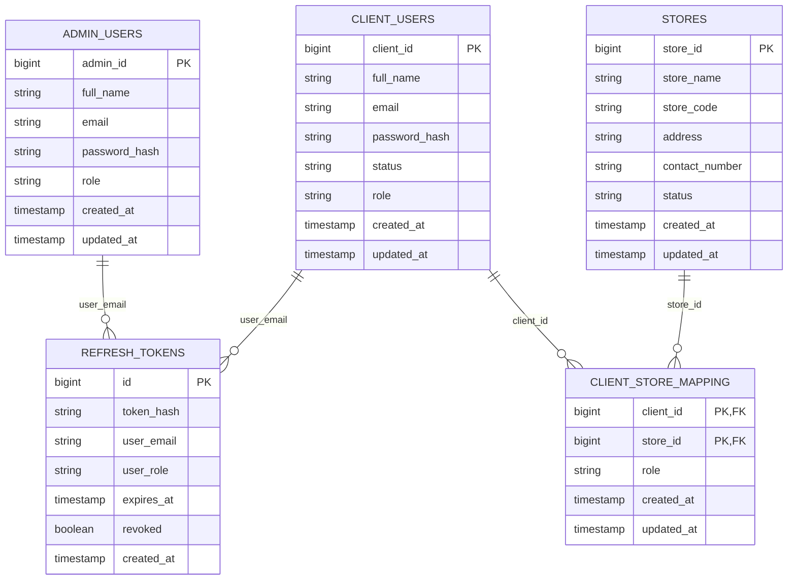
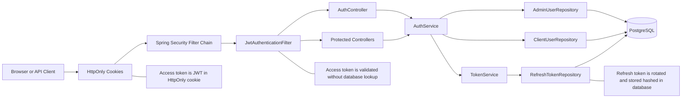
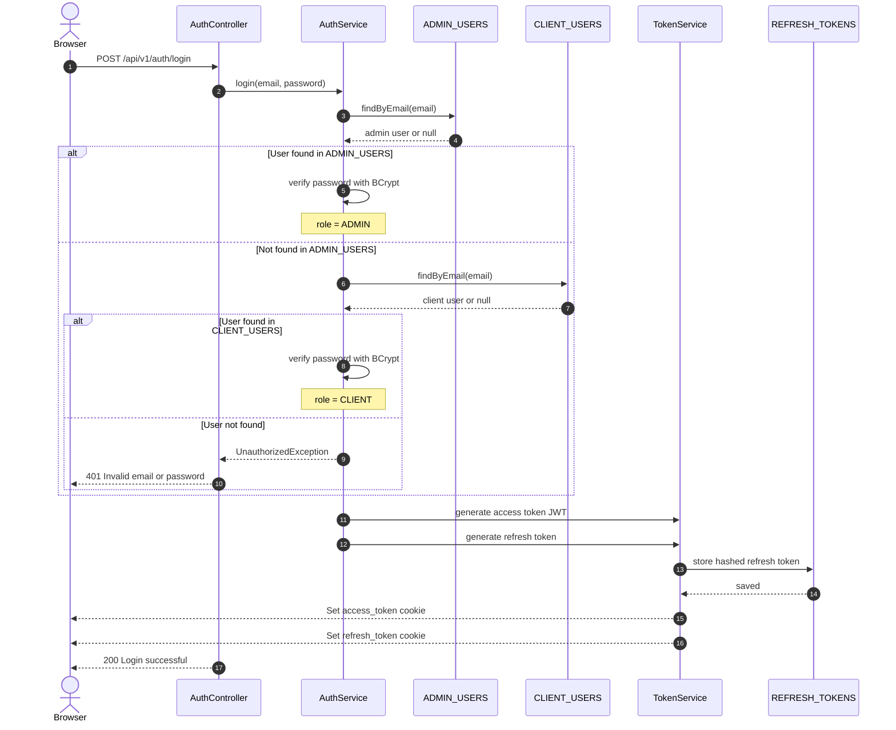
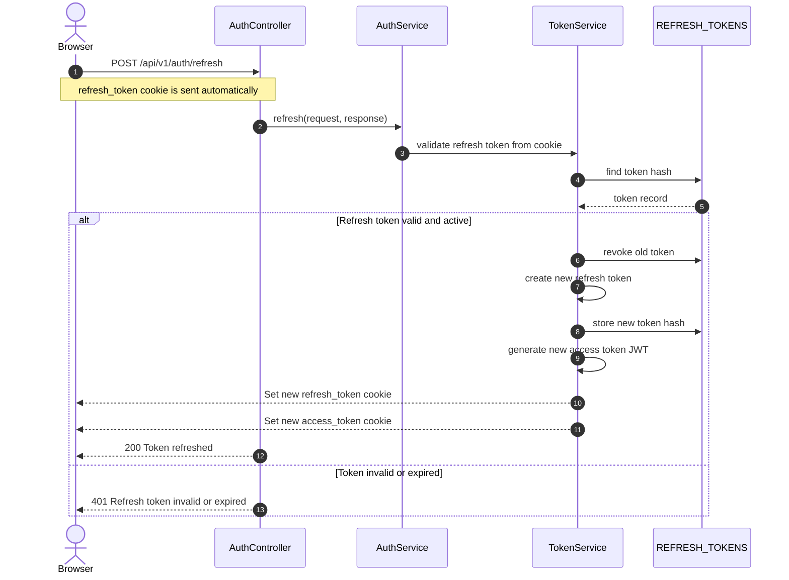
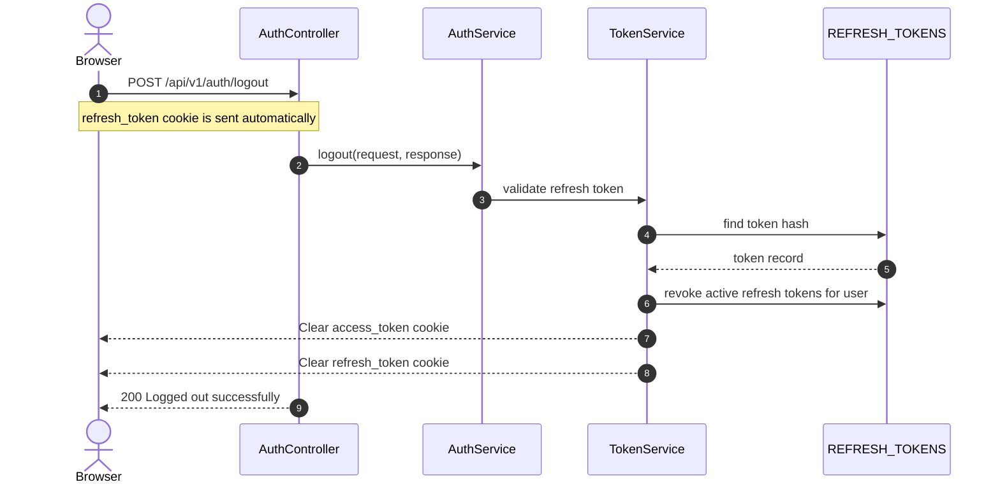
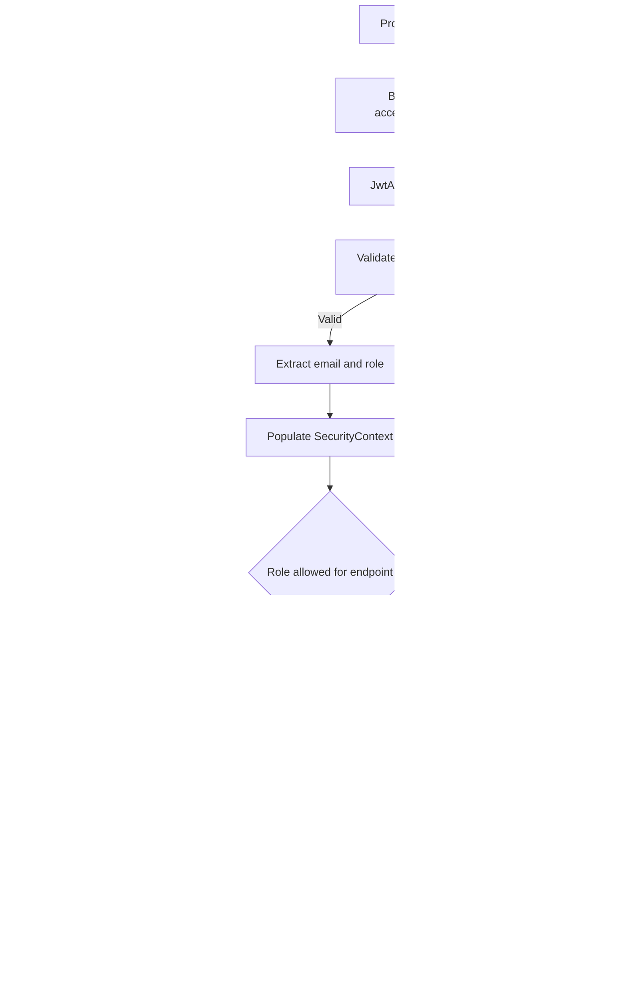
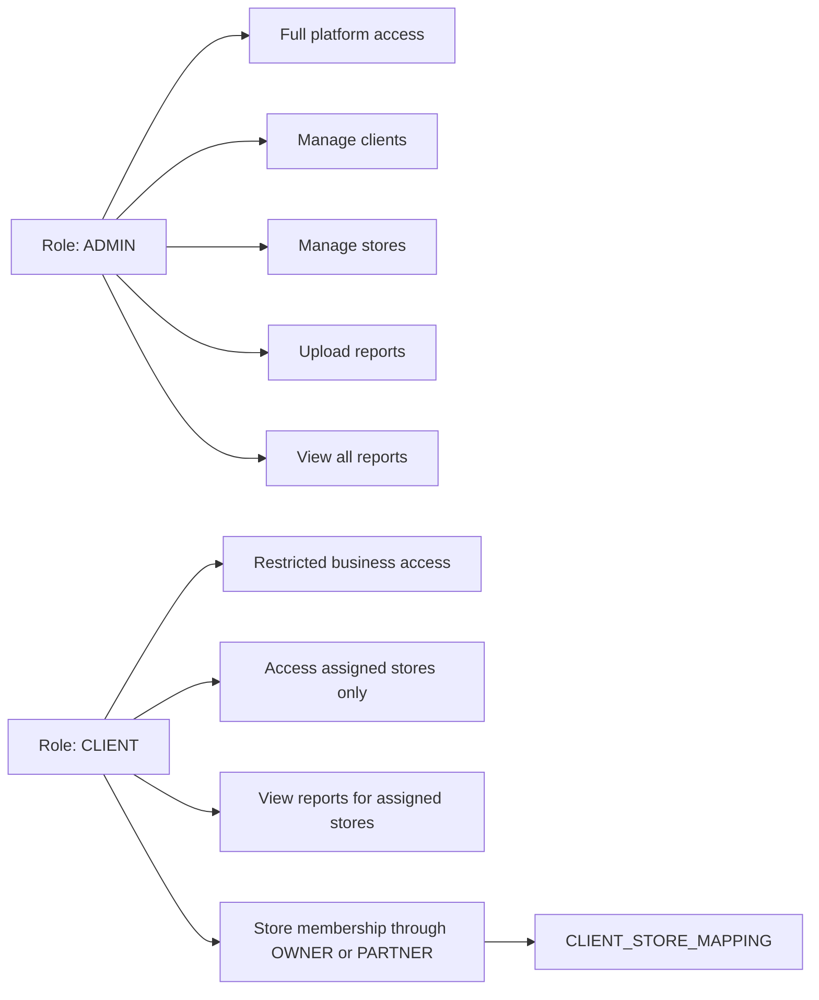
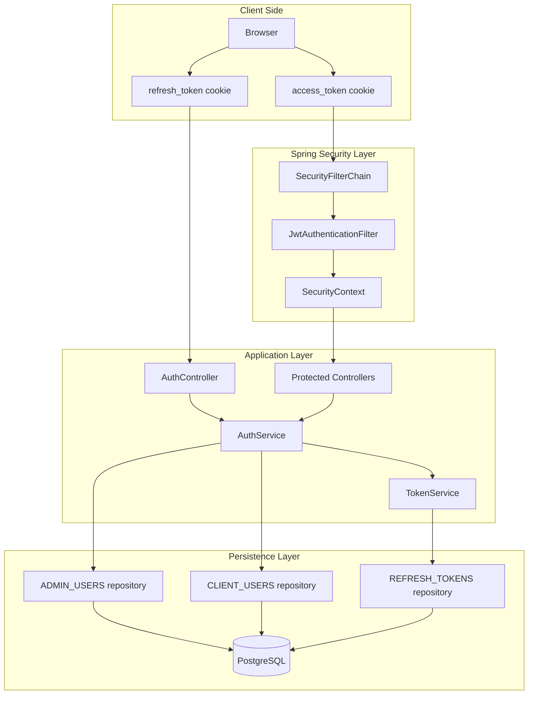

# Authentication And Authorization Diagrams

## 1. ER Diagram

## 2. Authentication Architecture Diagram

## 3. Login Sequence Diagram

## 4. Refresh Token Sequence Diagram

## 5. Logout Sequence Diagram

## 6. Authorization Flow Diagram

## 7. RBAC Diagram

## 8. Security Component Diagram

